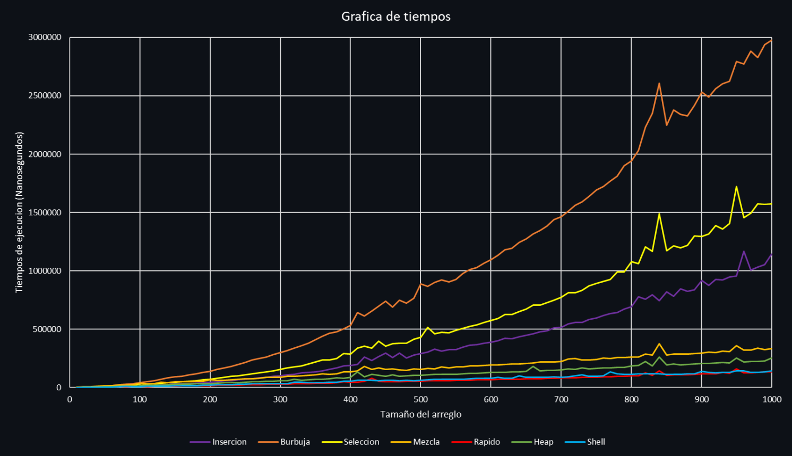

# 🦊 Comparación de Algoritmos de Ordenamiento

[](LICENSE) 

Este proyecto compara el rendimiento de varios algoritmos de ordenamiento en términos de tiempo de ejecución.

Los algoritmos incluidos son:
1. **Ordenamiento por Inserción (Insertion Sort)**
2. **Ordenamiento de Burbuja (Bubble Sort)**
3. **Ordenamiento por Selección (Selection Sort)**
4. **Ordenamiento por Mezcla (Merge Sort)**
5. **Ordenamiento Rápido (Quick Sort)**
6. **Ordenamiento por Montículos (Heap Sort)**
7. **Ordenamiento de Shell (Shell Sort)**

El proyecto genera datos aleatorios y mide en nanosegundos el tiempo que tarda cada algoritmo en ordenar arreglos de diferentes tamaños. Los resultados se exportan en archivos CSV.

## 📋 Requisitos

- **C++20**
- **g++ Compiler**
- **CMake** (opcional)

## 🔽 Compilación y Ejecución

### Compilación Manual

1. Clona el repositorio:
   ```bash
   git clone https://github.com/DashyDaFur/Comparacion-de-Algoritmos-de-Ordenamiento.git
   cd Comparacion-de-Algoritmos-de-Ordenamiento
   ```
2. Compila el código:
   ```bash
   g++ -o ordenamiento main.cpp -std=c++20
   ```
3. Ejecuta el programa:
   ```bash
   ./ordenamiento
   ```

### Uso de CMake

1. Clona el repositorio:
   ```bash
   git clone https://github.com/DashyDaFur/Comparacion-de-Algoritmos-de-Ordenamiento.git
   cd Comparacion-de-Algoritmos-de-Ordenamiento
   ```
2. Crea un directorio de compilación y compila el proyecto:
   ```bash
   mkdir build
   cd build
   cmake ..
   make
   ```
3. Ejecuta el programa:
   ```bash
   ./ordenamiento
   ```

## 🌳 Estructura del Proyecto

- **`main.cpp`**: Contiene el código principal que genera los datos, ejecuta los algoritmos de ordenamiento y exporta los resultados.
- **`README.md`**: Contiene una descripción general del proyecto.
- **`LICENSE`**: Contiene la licencia MIT.
- **Archivos CSV**: Los archivos CSV generados se guardan en el directorio raíz del proyecto.
- **Carpeta img**: Contiene todas las imágenes utilizadas en este repositorio.

## 🛠️ Configuración

Puedes modificar las siguientes constantes en el código para ajustar el programa:

- `NUM_ALGORITMOS`: Número de algoritmos de ordenamiento que se probarán.
- `NUM_PRUEBAS`: Número de pruebas que se realizarán para cada tamaño de arreglo.
- `MIN_TAM`: Tamaño mínimo del arreglo.
- `MAX_TAM`: Tamaño máximo del arreglo.
- `INCREMENTO`: Incremento en el tamaño del arreglo entre las pruebas.
- `MIN_NUM`: Valor mínimo de los números aleatorios generados.
- `MAX_NUM`: Valor máximo de los números aleatorios generados.

## ✅ Resultados

Los resultados se exportan a archivos CSV en el directorio raíz del proyecto. Cada archivo CSV contiene los tiempos de ejecución en nanosegundos para cada tamaño de arreglo y cada prueba.

### 📈 Grafica comparativa de los tiempos de ejecución

Los algoritmos se ejecutaron 1000 veces sobre arreglos aleatorios, con tamaños desde 10 hasta 1000 elementos en incrementos de 10. Los números generados para los arreglos estuvieron en el rango del 1 al 100. La gráfica muestra el tiempo promedio de ejecución obtenido en estas pruebas.

 



- 🚀 Mas rapidos: Quick sort y Shell sort.
- 🐢 Mas lentos: Bubble sort y Selection sort.

## 📜 Licencia  
Este proyecto está bajo la licencia [MIT](LICENSE).

