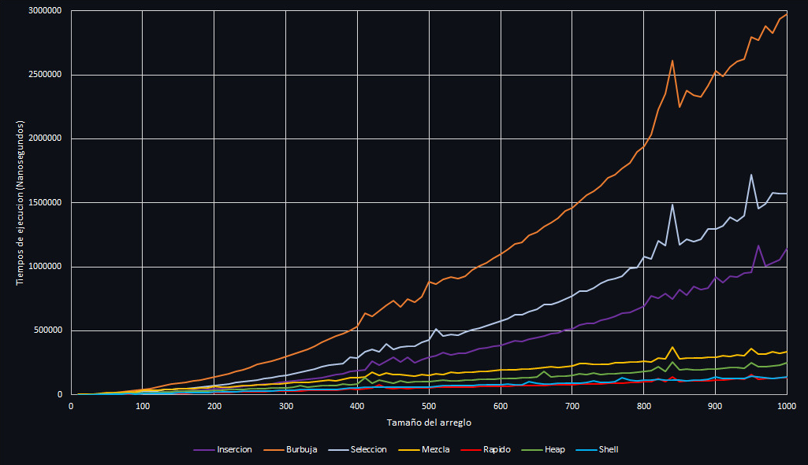
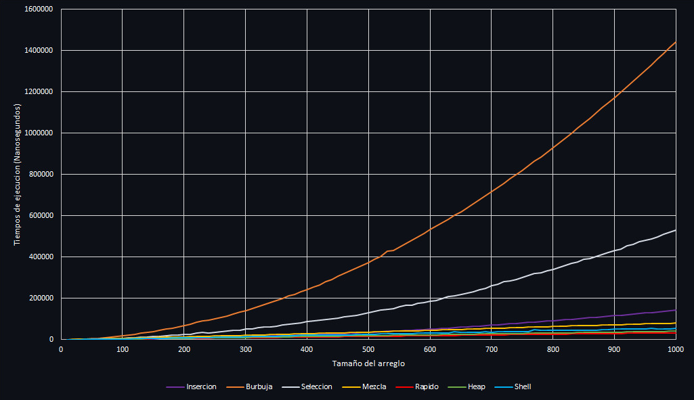

# 🦊 Comparación de Algoritmos de Ordenamiento

[](LICENSE) 

Este proyecto compara el rendimiento de varios algoritmos de ordenamiento en términos de tiempo de ejecución.

Los algoritmos incluidos son:
Los algoritmos incluidos son:
<details>
<summary><strong>1. Ordenamiento por Inserción (Insertion Sort)</strong></summary>
Recorre el arreglo tomando cada elemento y lo inserta en la posición correcta dentro de la sección ya ordenada, desplazando los elementos mayores hacia la derecha para hacer espacio.
</details>

<details>
<summary><strong>2. Ordenamiento de Burbuja (Bubble Sort)</strong></summary>
Compara repetidamente cada par de elementos adyacentes e intercambia sus posiciones si están en el orden incorrecto, haciendo que los elementos más grandes "burbujeen" hacia el final del arreglo.
</details>

<details>
<summary><strong>3. Ordenamiento por Selección (Selection Sort)</strong></summary>
Divide el arreglo en dos partes: ordenada y no ordenada. En cada iteración busca el elemento más pequeño en la parte no ordenada y lo intercambia con el primer elemento de esa sección.
</details>

<details>
<summary><strong>4. Ordenamiento por Mezcla (Merge Sort)</strong></summary>
Divide recursivamente el arreglo en mitades hasta obtener subarreglos de un solo elemento, luego los combina (merge) en orden comparando sistemáticamente los elementos de cada mitad ordenada.
</details>

<details>
<summary><strong>5. Ordenamiento Rápido (Quick Sort)</strong></summary>
Selecciona un pivote y reorganiza el arreglo colocando los elementos menores que el pivote antes que él y los mayores después, luego aplica el mismo proceso recursivamente a las sublistas resultantes.
</details>

<details>
<summary><strong>6. Ordenamiento por Montículos (Heap Sort)</strong></summary>
Transforma el arreglo en un montículo máximo (max-heap) donde el elemento padre es siempre mayor que sus hijos, luego extrae repetidamente el elemento máximo y reconstruye el montículo.
</details>

<details>
<summary><strong>7. Ordenamiento de Shell (Shell Sort)</strong></summary>
Compara elementos separados por un intervalo (gap) que disminuye progresivamente, permitiendo que elementos lejanos se muevan a sus posiciones correctas más rápidamente que en el insertion sort básico.
</details>

El proyecto genera datos aleatorios y mide en nanosegundos el tiempo que tarda cada algoritmo en ordenar arreglos de diferentes tamaños. Los resultados se exportan en archivos CSV.

## 📋 Requisitos

- **C++20**
- **g++ Compiler**
- **CMake** (opcional)

## 🔽 Compilación y Ejecución

### Compilación Manual

1. Clona el repositorio:
   ```bash
   git clone https://github.com/DashyDaFur/Comparacion-de-Algoritmos-de-Ordenamiento.git
   cd Comparacion-de-Algoritmos-de-Ordenamiento
   ```
2. Compila el código:
   ```bash
   g++ -o ordenamiento main.cpp -std=c++20
   ```
3. Ejecuta el programa:
   ```bash
   ./ordenamiento
   ```

### Uso de CMake

1. Clona el repositorio:
   ```bash
   git clone https://github.com/DashyDaFur/Comparacion-de-Algoritmos-de-Ordenamiento.git
   cd Comparacion-de-Algoritmos-de-Ordenamiento
   ```
2. Crea un directorio de compilación y compila el proyecto:
   ```bash
   mkdir build
   cd build
   cmake ..
   make
   ```
3. Ejecuta el programa:
   ```bash
   ./ordenamiento
   ```

## 🌳 Estructura del Proyecto

- **`main.cpp`**: Contiene el código principal que genera los datos, ejecuta los algoritmos de ordenamiento y exporta los resultados.
- **`README.md`**: Contiene una descripción general del proyecto.
- **`LICENSE`**: Contiene la licencia MIT.
- **`CMakeLists.txt`**: Contiene la configuracion en caso del uso de CMake
- **Carpeta Archivos CSV**: Contiene los archivos CSV generados con la configuracion predeterminada. Los **nuevos** archivos CSV generados se guardan en el directorio raíz del proyecto.
- **Carpeta img**: Contiene todas las imágenes utilizadas en este repositorio.

## 🛠️ Configuración

Puedes modificar las siguientes constantes en el código para ajustar el programa:

- `NUM_ALGORITMOS`: Número de algoritmos de ordenamiento que se probarán.
- `NUM_PRUEBAS`: Número de pruebas que se realizarán para cada tamaño de arreglo.
- `MIN_TAM`: Tamaño mínimo del arreglo.
- `MAX_TAM`: Tamaño máximo del arreglo.
- `INCREMENTO`: Incremento en el tamaño del arreglo entre las pruebas.
- `MIN_NUM`: Valor mínimo de los números aleatorios generados.
- `MAX_NUM`: Valor máximo de los números aleatorios generados.

## ✅ Resultados

Los resultados se exportan a archivos CSV en el directorio raíz del proyecto. Cada archivo CSV contiene los tiempos de ejecución en nanosegundos para cada tamaño de arreglo y cada prueba.

### 📈 Grafica comparativa de los tiempos de ejecución

Los algoritmos se ejecutaron 1000 veces sobre arreglos aleatorios, con tamaños desde 10 hasta 1000 elementos en incrementos de 10. Los números generados para los arreglos estuvieron en el rango del 1 al 100. Las gráficas muestran el tiempo promedio de ejecución obtenido en estas pruebas, probando diferentes sistemas operativos.

 



 



- 🚀 Mas rapidos: Quick sort, Shell sort y Heap sort.
- 🐢 Mas lentos: Bubble sort y Selection sort.

## 📜 Licencia  
Este proyecto está bajo la licencia [MIT](LICENSE).

